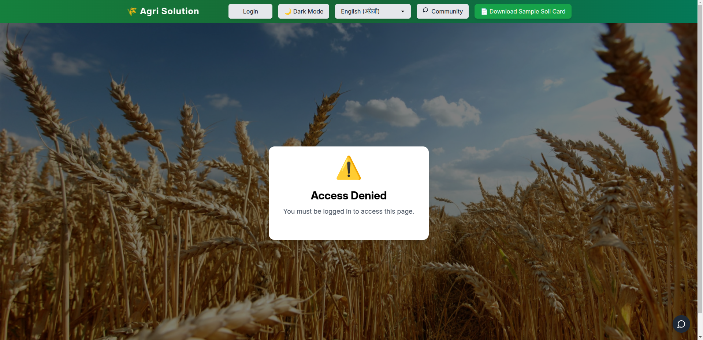
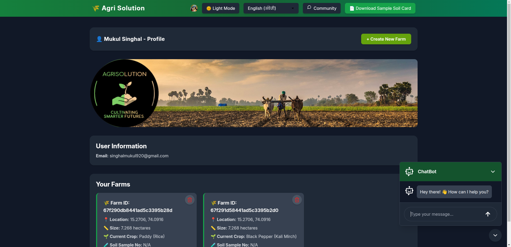
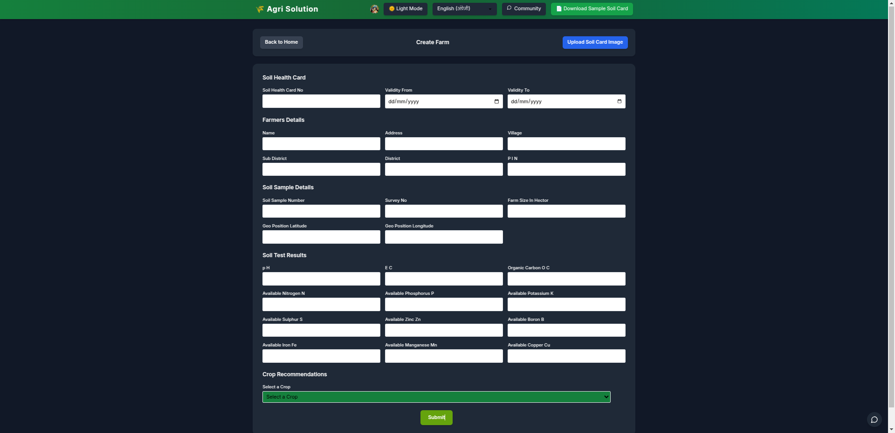
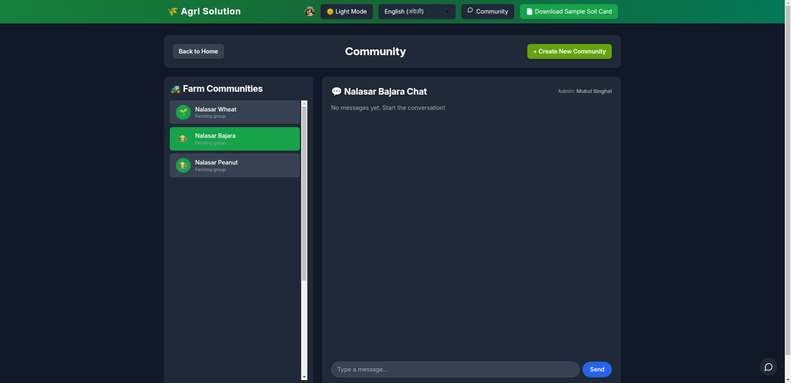
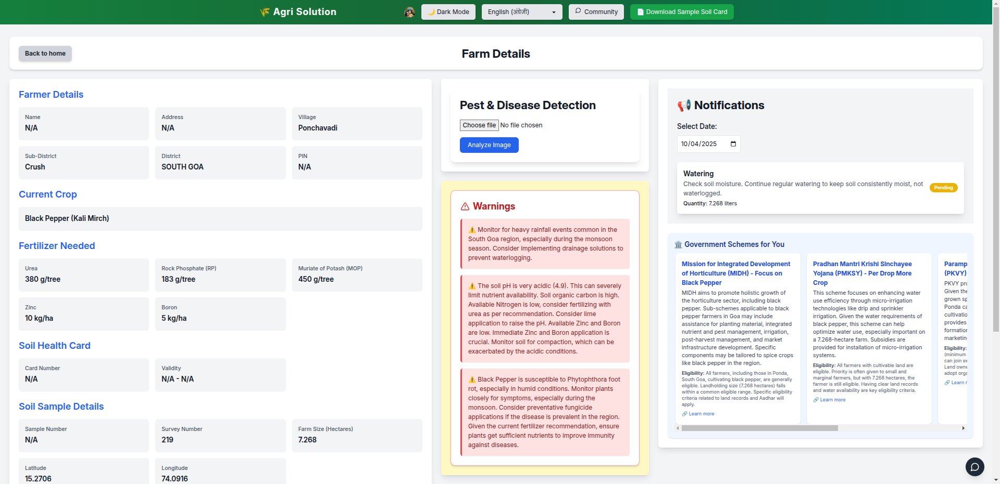
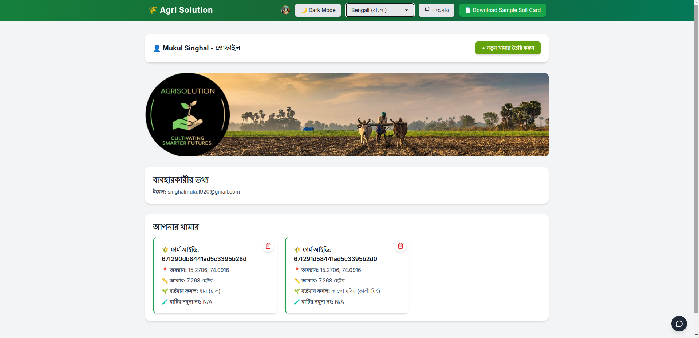

# 🌾  AgriSolution
## Harvesting the Future: AI Solutions for Smallholder Farmers 

---
## Deployment Link : 
https://agrisolution.vercel.app/

## Backend Gitub Link :
https://github.com/milanbhatiya59/AgriSolutionsBackend

---

## Description

AgriSolution is an AI-driven, all-in-one agricultural platform designed to support smallholder farmers—the unsung heroes who produce over 70% of the world’s food. Despite their vital role, these farmers often struggle with low yields, pest outbreaks, unpredictable weather, and limited access to expert guidance or government support.

Our platform is designed to empower smallholder farmers with real-time insights, smart crop planning, pest & weed detection, community support, and personalized government scheme recommendations.

---

## 🌟 Features

- 🌱 **Soil-based Crop & Fertilizer Recommendations**
- 🐛 **AI-driven Pest & Weed Detection via Image Analysis**
- 📊 **Yield Prediction & Best-Case Scenario Analysis**
- 💬 **Smart Chatbot for Real-time Agricultural Assistance**
- 🏛️ **Government Scheme Recommender (Region & Crop-wise)**
- 🌐 **Multi-language Support for Inclusive Access**
- 👨‍🌾 **Community Chat Platform for Farmer Knowledge Exchange**

---

## 🚀 Tech Stack

| **Frontend**        | **Backend**           | **Database** | **APIs & Integration**              |
|---------------------|------------------------|--------------|-------------------------------------|
| React JS            | Node.js (Express.js)   | MongoDB      | 🔴 Gemini API (Google AI Studio)    |
| Clerk               |                        |              | Google Translator                   |
| Tailwind CSS        |                        |              |                                     |
| JavaScript          |                        |              |                                     |

---


## 🛠️ Installation & Setup Guide


### ✅ Prerequisites

Before you begin, ensure you have met the following requirements:

- **Node.js** (v16 or above)
- **MongoDB** (local or cloud instance like MongoDB Atlas)
- **npm** or **yarn** for managing packages
- **Clerk** account for authentication
- **Google Cloud Account** for Gemini API and Google Translate API
- Basic knowledge of React and Node.js


### 🛠️ Setup Instructions

Follow these steps to set up and run the project locally:


#### 1️⃣ Clone the Repository

```bash
git clone https://github.com/your-username/AgriSolution.git
cd AgriSolution
```

#### 2️⃣ Install Frontend Dependencies
```
cd client
npm install
```
##### or
```
yarn install
```
#### 3️⃣ Install Backend Dependencies
```
cd ../server
npm install
```
##### or
```
yarn install
```

#### 4️⃣ Set Up Environment Variables

Create a .env file in both client and server directories and configure them as shown:

📁 .env in /server
```
MONGODB_URI=your_mongodb_connection_string
PORT=5000

# Clerk Secret Key
CLERK_SECRET_KEY=your_clerk_secret_key

# Gemini API
GEMINI_API_KEY=your_gemini_api_key

# Google Translate API
GOOGLE_TRANSLATE_API_KEY=your_translate_api_key
```

📁 .env in /client

```
VITE_CLERK_PUBLISHABLE_KEY=your_clerk_publishable_key
VITE_GEMINI_API_BASE_URL=http://localhost:5000/gemini

```

#### 5️⃣ Run the Application

Start Backend
```
cd server
npm run dev
```
Start Frontend
```
cd ../client
npm run dev
```

Now open http://localhost:5173 to use the app.

---
## Screenshots

### Login Page


### Home Page


### Dark Mode


### Add New Farm 


### Community Chat


### Farm Card 
##### Regular Notifications/ Updates, Government Schemens, Pest & weed detection


### Multi Lingual Support



---

For further details, please contact the project contributors.

